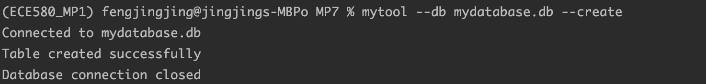
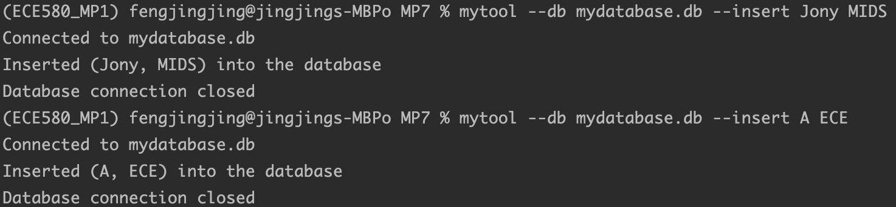
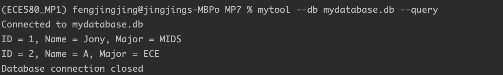
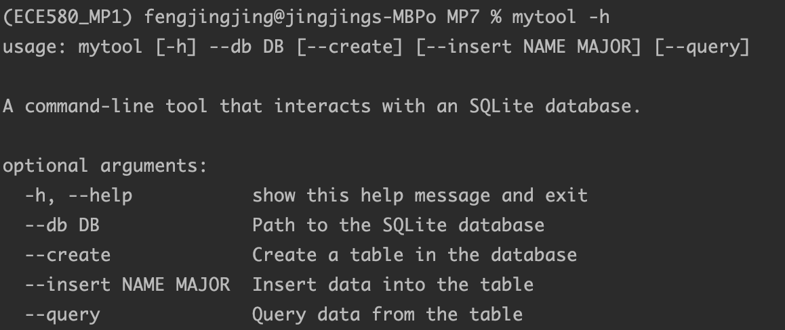

# jf361_ids706_mp7
[](https://github.com/siyiia/jf361_ids706_mp7/actions/workflows/cicd.yml)

## Project Introduction
This project is to package a Python script into a Command-Line Tool


## Project Requirments
- Package a Python script with setuptools or a similar tool
- Include a user guide on how to install and use the tool
- Include communication with an external or internal database

## Tool Description
MyTool is a command-line interface (CLI) that interacts with an SQLite database.
That store the information about the student id, name, and major.

## Guidelines for the Use of Tool
### Installation
Clone the repository and install the tool:
```bash
git clone https://github.com/siyiia/jf361_ids706_mp7.git
pip install .
```

### Usage
#### Create a Table
```
mytool --db <database_name>.db --create
```
#### Insert Data
```
mytool --db <database_name>.db --insert <Name> <Major>
```
#### Query Data
```
mytool --db <database_name>.db --query
```
#### Help Menu Guides
```
mytool --h
```

## Screenshots of Usage
### Create a Table
<p>
  
</p>

### Insert Data
<p>
  
</p>

### Query Data
<p>
  
</p>

### Help Menu Guides
<p>
  
</p>